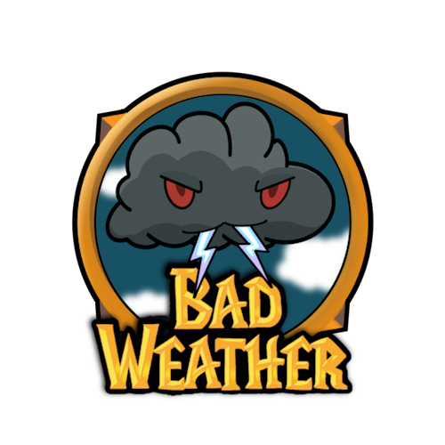

# Bad Weather

嗨，我們是 Bad Weather 公會。

無論是聯盟或部落的玩家，我們都歡迎！聯盟玩家可以用遊戲內「公會搜尋器」找到公會；部落玩家則需要從認識的會員獲得邀請（這是目前系統的限制）。

我們原本人很少，為了會員在艾澤拉斯旅行需要幫助時，能快速找到遊戲資訊，才做了這個網站。現在公會漸漸茁壯，除了分享遊戲資訊，也開始用網站說明公會和團隊制度。

---

## 目錄

主要內容：

- [公會須知](guidelines.html)（**必讀**）
- [嗨，可口的新手](newbies.html)
- [嗨，回鍋的老朋友](oldfriends.html)
- [會階](ranks.html)
- [收人規則](recruitment.html)
- [團隊活動](raid.html)（[趴熊團](bear.html)、[熊寶寶團](babybear.html)）
- [公會活動](activities.html)
- [公會語音](voicechat.html)
- [插件和網路資源](useful.html)

其他內容：

- [歷任幹部](alumni.html)
- [其他遊戲](othergames.html)

--- 

## 聯絡

歡迎用[匿名幹部信箱](https://1a4nr73j.forms.app/mailbox)發表意見。這個信箱只有公會幹部看得到，而且不會知道寄件人是誰（除非自己說）。

也可以用遊戲內信件或密語找 [`Bankruiters`](ranks.html)（公會幹部）分享想法，讓這個公會變得更好。

文件變更請參考[公開紀錄](https://github.com/dalechou/badweather.tw/commits/master/index.md)，不會另外公告。