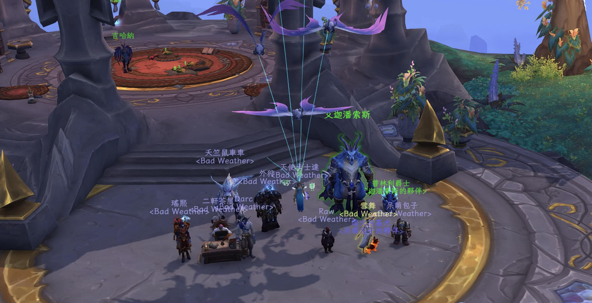
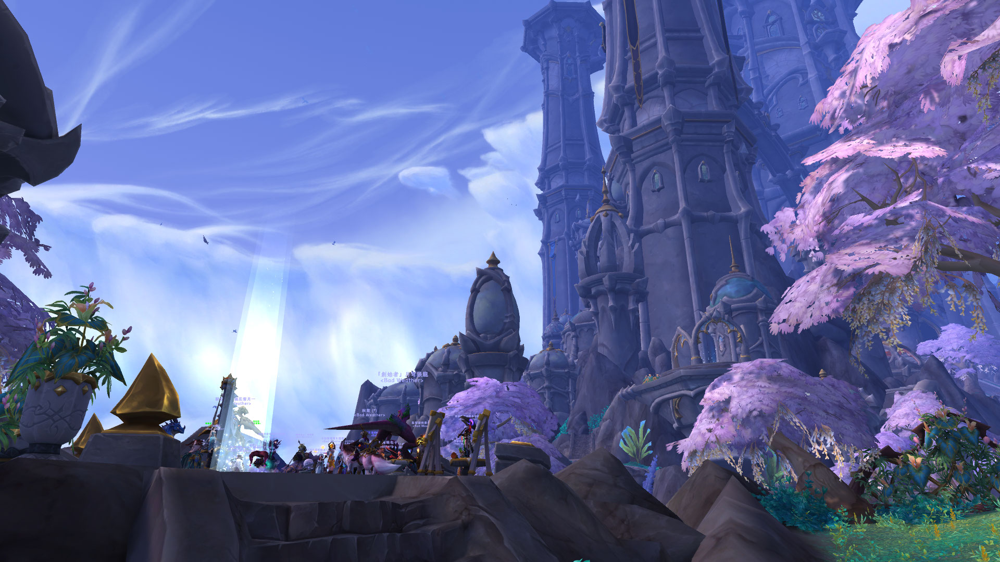
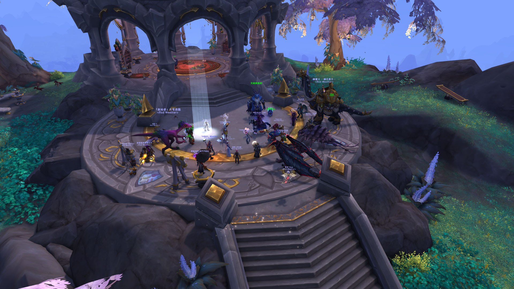

# Bad Weather
### [首頁](index.html)　　[公會須知](guidelines.html)　　[回鍋資訊](oldfriends.html)　　[收人規則](recruitment.html)　　[團隊活動](raid.html)　　[公會活動](activities.html)　　[公會語音](voicechat.html)

---

## 新春發錢錢活動

2026 年依然在沃卓肯幼兒園舉辦「新春發錢錢」，這個地點快變成傳統了。活動舉辦前幾天，戰隊銀行故障，所有人的紅包一度下落不明，幸好後來修好了，這個故事告訴我們不要相信銀行（？）。這次活動在連假尾聲，參加的人不多，但都是很棒的人，很開心活動能順利辦成。祝福大家新年快樂！

---

2025 年繼續在沃卓肯幼兒園舉辦「新春發錢錢」，由睡夢中被挖起來的天使洋分發禮物，米南宮幫忙照相，Paimia 和蔻醬解決 Cartier 的紅包。這次活動很榮幸有友會 TequilaSunrise 的 Chingbaby 來參加！

---

2024 年持續舉辦「新春發錢錢」活動，公會準備了金幣和各項獎品，並依往例，特別大骰或特別小骰的人可以選擇換成神秘禮物。感謝天使洋準備獎品，蔻醬幫忙說明規則。由於活動當天會長的桌機已經送上海運，所以主持得手忙腳亂，還忘了拍照！

---

2023 年初五公會再次舉辦抽獎活動，共 36 人參加。這次獎品一樣有遊戲時間、金幣，特別大骰或特別小骰的人可以選擇換成神秘禮物。在此特別感謝天使洋、早安布布事前幫忙採購禮物，蔻醬幫忙說明規則。

用藍色條紋紙包了 28 個禮物，最終只送出 2 個，小骰公會迴避禮物的天賦點得好高……總之，謝謝大家參與活動！

---

2022 年初三公會辦了抽獎活動，共 27 人參加，鐵爐堡好久沒這麼熱鬧了！

這次抽獎送出遊戲時間和金幣，另外特別感謝 Fanudihoul 贊助安慰獎十五萬金坐騎三個、玩具四個，榛果布朗尼贊助小熊貓三隻，還有沒忘記拍照的早安布布跟緋月。

以下是相當驚人的小骰紀錄……

謝謝大家參與！

--- 

請[點此](index.html)回首頁。

文件變更請參考[公開紀錄](https://github.com/dalechou/badweather.tw/commits/master/lunar.md)，不會另外公告。