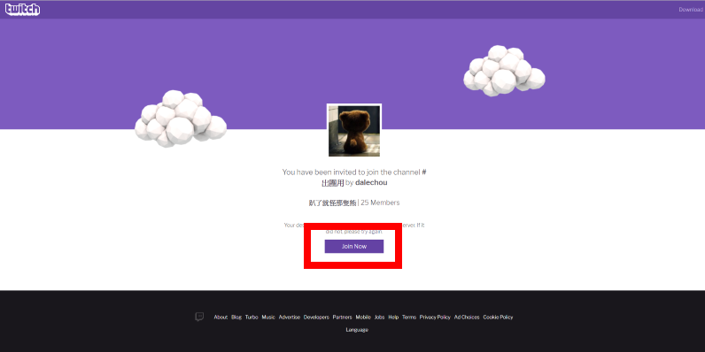

## 趴了就怪那隻熊 ʕᵔᴥᵔʔ

我們是台灣《魔獸世界》聯盟跨伺服器團。

| **坦克** | **補師** | **遠程** | **近戰** |
| --- | --- | --- | --- |
| Darc | **香緹紗** | 一灰羽一 | 龍蝦三爭霸 |
| 阿魔達 | 加五元變大薯 | 開朗露營家 | 安腥氬 |
| **喔啊啊** | 沙發破一個洞 | Yoyoman | 諾勒斯夜咒 |
| | 小兔牙妹 | 呆萌包子 | 狼師獸液 1 |
| | 蘇塞魯斯 | 在光中升起 | 霜凍之楓 |
| | 妹妹大人 1 | 星火燎原 | 烏邦果 |
| | 老婆不在家 | 奈何 | 太天才了 1 |
| | | 取名真是難 | 鐵礦 1 |
| | | 橒夢 | 長髮法師 1 |
| | | 裘莉雅 1 | 先發 1 |
| | | 獨孤娜娜 | 坎達爾珍娜 |
| | | 灰瞳 |  |
| | | **小唯醬** | |

這是固定出團名單，每週請用名單上的角色出團。團員 34 人。

粗體字表示雙修專精，只列出目前團隊會用到的，辛苦你們了。

## 出席報告

5/17 會晚到：加五元變大薯（QQ）、安腥氬

1 遞補席位。相關說明請往下拉。

## 分身誰是誰

版本末分身比較多，但其實很多都是老團員。這裡還是報告一下。

- 老婆不在家：歐巴馬（吃飯飯）
- 橒夢：Sio
- 裘莉雅：神經
- 獨孤娜娜：阿幹
- 灰瞳：妮爾
- 烏邦果：我覺得不行（Eli）
- 坎達爾珍娜：吉吉

---

## 出團紀錄

出團紀錄請看 [Warcraft Logs](http://tinyurl.com/dalewarcraftlogs)。

目前剛拓過英雄燃燒王座。

每一個版本的目標是英雄全通，拿到「領先群雄」成就。不會挑戰傳奇難度。

歷史戰績：
- 領先群雄：[滅界者阿古斯](aotc_argus.jpg)
- 領先群雄：基爾加丹（[當時忘了合照](aotc_kiljaeden.jpg)，[隨便傳一個](aotc_kiljaeden2.jpg)）
- 領先群雄：[古爾丹](aotc_guldan.jpg)

---

## 語音

使用 [Twitch](https://app.twitch.tv/download)，房間位置：[RNv9fX](https://invite.twitch.tv/RNv9fX)

語音使用方法：
- 打開 Twitch App，然後登入（這步驟一定要先做）
- 點選上方房間連結
- 點選上圖紅色框框按鈕
- 找到房間後，加入最愛

另外有下列備用語音：
- [Discord](https://discord.gg/Jyn6ERe)（評估中）
- [Battle.net App Social](https://blizzard.com/invite/MpAJNTMNA)

---

## 時間

每週四晚 21:00 – 00:00 出團，20:50 開組。

請在出團前修好裝備，並記得攜帶出團期間會用到的東西。開組後請不要離隊解任務；進組後請不要早退。

**如果預先知道會早退，請全程請假。**

說明：身為團長，掌握的團員個人資訊是最多的，雖然會盡量做到「公平」以及「對團隊好」，但實行上有一定的衝突需要平衡。例如團長可能知道有些人早退是不得不，有些人卻只是想躲掉拓荒，其中判定準則就包括了許多個人資訊，不一定所有細節都能完整跟全團說明。

如果完全用個人資訊判斷是否可以容許早退，看起來就會像有些人是特例，有些人不是──但其實絕對不是這樣的。為了讓遊戲規則簡潔透明，如果預先知道會早退，請全程請假。人員調度的事情讓團長煩惱就好。

總之，希望大家都能好好安排這一週中的三小時，好好跟其他二十幾個人享受這個遊戲。

---

## 準備工作以及責任

團隊會補助大餐、大鍋。如果是聖光之願、天空之牆的團員會補助符文。如果是 [Bad Weather](https://dalechou.github.io/wow/) 公會成員會補助修裝費。

通常有大鍋吃，但每 CD 請準備自用精煉至少三瓶；通常有大餐可以吃，但每 CD 請準備自用食物至少一組。公會成員可以直接拿會倉的。

團員需要負責身上附魔、寶石。原則上使用當前版本的東西，但像坦附魔可能 6.x 比 7.x 好除外。

說明：出團的樂趣在於挑戰極限，挑戰邊際，無論是團隊的或自己的。相信有些人就算沒有附魔、寶石還是能打出亮眼的成績，但只有盡力做到最好，才知道能走多遠。

---

## 分裝

分裝：個人拾取

系統分裝結果（含但不限於裝綁、塑形、坐騎、寵物）可依個人喜好處置，不一定要 /roll。

說明：這個團曾經在 7.2.5 和 7.3.0 考慮過是不是要改成其他分裝制度，讓團員能更有效地獲得裝備。但我們從 7.0.0 翡翠夢魘到現在，很幸運都沒有抓馬，團員也趨向穩定。很珍惜這一切。

目前共識仍認為個人拾取是最公平的制度，每週開寶也滿有趣的，所以會繼續使用個人拾取制度。希望團隊也能因此更長久一點。

---

## 是戰犯！你在隱藏什麼？

抓戰犯請用密語──「趴了就怪那隻熊」吧。

說明：適時指出錯誤很重要，但指出錯誤的方法以及歸因是否正確也很重要。在網路上要當正確的那個人很容易，要當能一起合作的那個人，就比較困難了。出團時大家會分工合作，一起克服困難，但「分工」這件事就代表每一個人（包括團長）都很難看到問題全貌。可以用密語跟團長溝通，盡量描述自己觀察到的現象，幫助很大的。

---

## 團長收超過 30 人怎麼辦？

團長的責任包括：
- 確保團隊進度
- 盡量帶人參與出團活動

基於這兩點，原則上不會超收團員。然而隨著團員數逼近 30 人，只要稍微浮動就可能超收，還是有必要訂定超收處理方式，包括下列六項：
- 所有「超收前入團」且「穩定出席」團員保障固定席位
- 所有「超收前入團」但「不穩定出席」團員轉遞補席位
- 明確向所有「超收後入團」團員說明目前情況，並且安排遞補席位
- 出團時有空位由遞補席位補人進副本，團長會在 21:00 以前確定遞補席位誰可以進副本
- 日後依穩定度由遞補席位補固定席位，團長每個月最後一個 CD 會報告補位情況
- 固定席位小於 30 人前不再補人

說明：**遞補席位跟能力無關。**而是系統只能帶 30 人進副本，想盡量追求公平的權宜之計。

---

## 分身更替

以下是在正常資料片中分身更替的時機。

也就是說有三次機會可以換分身：版本初、第二個王比較多的團隊副本、最後一個團隊副本。請盡量利用這些機會；換分身仍需要預先跟團長討論；除此以外的時間如果想換分身，也可以跟團長討論。

預先安排分身更替的目的：
- 讓大家可以玩得長久，比較不膩
- 控制不確定因素，確保團隊進度

---

## 聯絡

- BattleTag: dale#3350

現在手機可以裝 Battle.net App（[Android](https://play.google.com/store/apps/details?id=com.blizzard.messenger)/[iOS](https://itunes.apple.com/us/app/blizzard-battle-net/id1241040030)），滿好用的。

請[點此](https://dalechou.github.io/wow/)回目錄。

文件變更請參考[公開紀錄](https://github.com/dalechou/wow/commits/master/raid.md)，不會另外公告。
