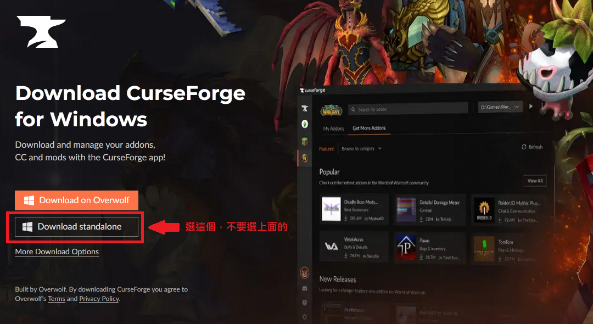

## 插件：副本

《魔獸世界》的遊戲體驗可以透過玩家開發的插件改善。目前最主流的插件網站是 [CurseForge](https://www.curseforge.com/wow/addons)，可以在這裡下載插件，手動安裝。

如果覺得手動更新插件很麻煩，可以用 [CurseForge](https://download.curseforge.com/) 軟體管理插件。請記得下拉畫面，選擇正確的安裝版本，不要裝到 Overwolf。

以下是跟副本相關的插件。

- [DBM](https://www.curseforge.com/wow/addons/deadly-boss-mods)：副本機制提醒
- [Details!](https://www.curseforge.com/wow/addons/details)：看戰鬥數據
- [GTFO](https://www.curseforge.com/wow/addons/gtfo)：常常莫名其妙死掉請裝這個

## 插件：遊戲生活品質

- [TomTom](https://www.curseforge.com/wow/addons/tomtom)：在網路討論看到座標，不知道座標怎麼找，可以用這個（不過這個插件似乎會造成 [taint](https://forum.gamer.com.tw/Co.php?bsn=05219&sn=2498142)，請自行評估要不要裝）
- [HandyNotes](https://www.curseforge.com/wow/addons/handynotes)：可以幫助玩家找到想找的東西，例如想寶藏等，需要搭配其他插件使用，例如 [HandyNotes: The War Within](https://www.curseforge.com/wow/addons/handynotes-the-war-within)

## 插件：WeakAuras（又稱 WA）

因為 [WA](https://www.curseforge.com/wow/addons/weakauras-2) 雖然強大，但也複雜，所以特別切出來自己一區。

有興趣可以參考 [Wago.io](https://wago.io/weakauras) 和 [Wowhead](https://www.wowhead.com/guide/how-to-create-and-use-weakauras-5929) 相關資源。另外[批踢踢](https://www.ptt.cc/bbs/WOW/M.1488827820.A.769.html)、[巴哈姆特](https://forum.gamer.com.tw/Co.php?bsn=05219&sn=5351696)、[NGA](https://bbs.nga.cn/read.php?tid=4655386&rand=613) 也有教學。

- [副本時間軸](https://wago.io/RaidAbilityTimeline)
- [滑鼠位置](https://wago.io/HkjSU79zz)

## 網路資源

- [公會頁面](https://worldofwarcraft.com/zh-tw/guild/tw/lights-hope/bad-weather)
- [伺服器狀態](https://worldofwarcraft.com/zh-tw/game/status)
- [官方新聞](https://worldofwarcraft.blizzard.com/zh-tw/news)
- [官方頻道](https://www.youtube.com/channel/UCgNBSxvqQMhVYBo-XSnmbqg)
- [Icy Veins](https://www.icy-veins.com/wow/class-guides)：不會玩可以看這裡
- [Archon](https://www.archon.gg/wow)：查當前主流
- [Bloodmallet](https://bloodmallet.com/)：選裝備
- [Raidbots](https://www.raidbots.com/simbot)：跑模擬
- [Wowhead 天賦模擬器](https://www.wowhead.com/talent-calc)
- [Wowhead 角色進度查詢](https://www.wowhead.com/attunement)
- [Wowhead 塑形模擬器](https://www.wowhead.com/dressing-room)：小心，時間會不知不覺過去！

## 教學

- [談顯示設定優化](https://forum.gamer.com.tw/Co.php?bsn=05219&sn=5266501)

## 很專心做教學內容的實況主

- [老布](https://www.youtube.com/channel/UC10y77XO8L__flCLV2sfCvw)（例如[這個職業做什魔](https://www.youtube.com/watch?v=5DvOgT2Y-P8&list=PLFdmEzD9h-PMRyebLLK4lbTurrKIIapso)系列影片）

--- 

請[點此](index.html)回目錄。

文件變更請參考[公開紀錄](https://github.com/dalechou/badweather.tw/commits/master/useful.md)，不會另外公告。
