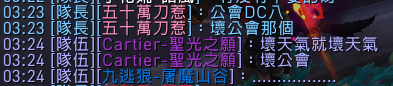

# Bad Weather
### [首頁](index.html)　　[公會須知](guidelines.html)　　[回鍋資訊](oldfriends.html)　　[收人規則](recruitment.html)　　[團隊活動](raid.html)　　[公會活動](activities.html)　　公會語音

---

## 公會語音

很多[公會活動](activities.html)都會用到語音，請先下載 [Discord](https://discordapp.com/)（網頁版不好用），要用時比較方便。

連結：[https://discord.gg/badweather](https://discord.gg/badweather)（同公會名）

進入頻道後請把名字改成遊戲內主要使用角色名稱，遵守頻道規定。

公會語音**可以**和公會以外的人分享。

--- 

## 副本勿擾專區

公會語音設置了「副本勿擾專區」，衝層等需要專注的活動可以多多利用。

請觀眾進入這區確保麥克風靜音，不要開麥，靜靜看或聽就好。

---

請[點此](index.html)回首頁。

文件變更請參考[公開紀錄](https://github.com/dalechou/badweather.tw/commits/master/voicechat.md)，不會另外公告。